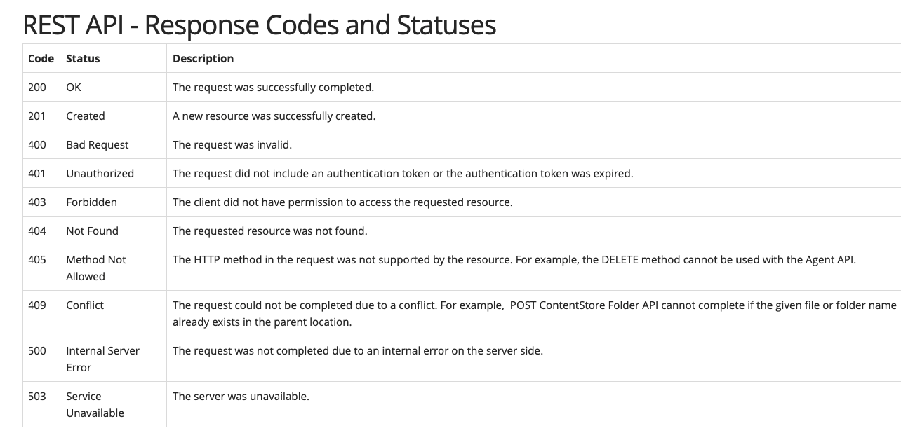

## REST

Representational state transfer It is architactural style as well as an apprroch of comminication purpose thats is often used by web service development .

REST (REpresentational “State” Transfer) architecture style/pattern - the server does not store any state about the client session on the server side.This restriction is called Statelessness.

## RESTful web service/api

Application that implements REST.

## Why REST is called stateless?

Statelessness means that every HTTP request happens in complete isolation. When the client makes an HTTP request, it includes all information necessary for the server to fulfill that request. The server never relies on information from previous requests. If that information was important, the client would have sent it again in this request.

## REpresentational State Transfer
REST stands for REpresentational State Transfer. It means when a RESTful API is called, the server will transfer to the client a representation of the state of the requested resource. 

## Example

when a developer calls Instagram API to fetch a specific user (the resource), the API will return the state of that user, including their name, the number of posts that user posted on Instagram so far, how many followers they have, and more. The representation of the state can be in a JSON format, and probably for most APIs this is indeed the case. It can also be in XML or HTML format.


## Advantages of Statelessness
There are some very noticeable advantages for having REST APIs stateless.

1) Statelessness helps in scaling the APIs to millions of concurrent users by deploying it to multiple servers. Any server can handle any request because there is no session related dependency.

2) Being stateless makes REST APIs less complex – by removing all server-side state synchronization logic.

3) A stateless API is also easy to cache as well. A specific software can decide whether or not to cache the result of an HTTP request just by looking at that one request. There’s no nagging uncertainty that state from a previous request might affect the cacheability of this one. It improves the performance of applications.

4) The server never loses track of “where” each client is in the application because the client sends all necessary information with each request.

## Difference between REST and SOAP

**REST**

* REST stands for Representational State Transfer
  
* REST permits different data format such as Plain text, HTML, XML, JSON, etc. But the most preferred format for transferring data is JSON.
  
* Statelessness – If there is no need to maintain a state of information from one request to another then REST should be used. If you need a proper information flow wherein some information from one request needs to flow into another then SOAP is more suited for that purpose. We can take the example of any online purchasing site. These sites normally need the user first to add items which need to be purchased to a cart. All of the cart items are then transferred to the payment page in order to complete the purchase. This is an example of an application which needs the state feature. The state of the cart items needs to be transferred to the payment page for further processing.
  
* REST can make use of SOAP as the underlying protocol for web services, because in the end it is just an architectural pattern.

* REST does not need much bandwidth when requests are sent to the server. REST messages mostly just consist of JSON messages. Below is an example of a JSON message passed to a web server. You can see that the size of the message is comparatively smaller to SOAP.
```
  {"city":"Mumbai","state":"Maharastra"}
```


**SOAP**

* SOAP stands for Simple Object Access Protocol 

* SOAP can only work with XML format. As seen from SOAP messages, all data passed is in XML format.

* Stateful operations – if the application has a requirement that state needs to be maintained from one request to another, then the SOAP 1.2 standard provides the WS* structure to support such requirements.

* SOAP cannot make use of REST since SOAP is a protocol and REST is an architectural pattern.

* SOAP requires more bandwidth for its usage. Since SOAP Messages contain a lot of information inside of it, the amount of data transfer using SOAP is generally a lot.

```
  <?xml version="1.0"?>
  <SOAP-ENV:Envelope 
  xmlns:SOAP-ENV
  ="http://www.w3.org/2001/12/soap-envelope" 
  SOAP-ENV:encodingStyle
  =" http://www.w3.org/2001/12/soap-encoding">
  <soap:Body>
  <Demo.guru99WebService
  xmlns="http://tempuri.org/">
    <EmployeeID>int</EmployeeID>
    </Demo.guru99WebService>
  </soap:Body>
  </SOAP-ENV:Envelope>
```

**Error Code**

Sequence 

200 - Ok

201 - Created

401 - Unauthorized

404 - requestd resoruce /endpoint not found

400 - bad request ( body is missing )

405 - Method Not Allowed ( invoking POST insead of GET )

403 - Forbidden - The client did not have permission to access the requested resource.




